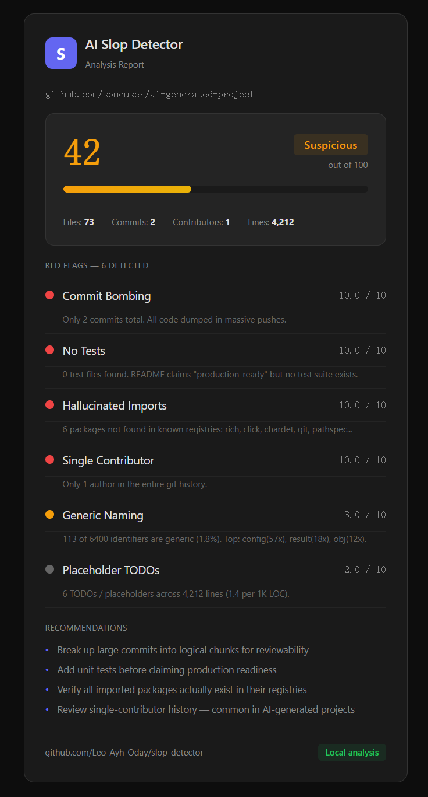

# AI Slop Detector

Detect AI-generated code patterns in any GitHub repository. One click, instant report.

## How it works

1. Extension sends the repo URL to a local Python server
2. Server clones the repo, scans all source files with tree-sitter
3. 9 heuristic detectors check for AI slop patterns
4. Returns a 0-100 score with red flags and recommendations

**Your code never leaves your machine.** No API keys, no cloud, fully local.

## Quick Start

```bash
pip install -r requirements.txt
python server.py
```

Then load the extension:

1. Open `edge://extensions` (or `chrome://extensions`)
2. Enable **Developer mode**
3. Click **Load unpacked** → select the `extension/` folder
4. Browse any GitHub repo → click the extension icon → **Analyze Repository**

## Pricing

**3 次免费分析**，无限次需激活码。~~$9.9~~ **$5（≈¥35）** — 一次性买断，永久更新。

### 购买激活码

加微信 **f01290724** → 转账 ¥35 → 我发你激活码 → 粘贴解锁

3 次免费用完后再付，觉得有用再买。有问题 V2EX 站内 DM [@Leo-Ayh-Oday](https://v2ex.com)。

---



> 代码 100% 本地分析，数据不出电脑。无需 API Key，无需联网。

## Scoring

| Score | Verdict |
|-------|---------|
| 80-100 | Clean |
| 40-79 | Suspicious |
| 0-39 | Likely AI Slop |

## 9 Detection Signals

- **Commit Bombing** — all code in 1-2 massive commits
- **Generic Naming** — `data`, `temp`, `result` everywhere
- **Over-commenting** — obvious comments, comment-to-code ratio >40%
- **No Tests** — zero tests but README claims "production-ready"
- **Hallucinated Imports** — importing packages that don't exist
- **Single Contributor** — only one author in git history
- **Template Structure** — matching stock scaffold with no changes
- **Spray-and-Pray PRs** — lots of single-commit branches named `fix`, `update`, `wip`
- **Placeholder TODOs** — `# TODO`, `pass`, `NotImplementedError` density

## Requirements

- Python 3.10+
- Git (for cloning repos)
- Chrome or Edge browser

## License

MIT
